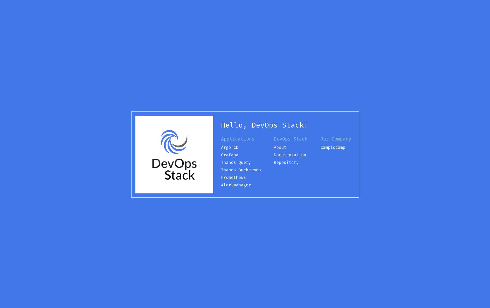

= devops-stack-helloworld-templates

Helm templates used to deploy the start page for the https://devops-stack.io[DevOps Stack].

== Objective

We use this repository as an example of how to deploy an application using our DevOps Stack. This also allows the user to test some core functionality of a newly deployed cluster:

- check that Argo CD, Grafana, Thanos, Prometheus and/or Alertmanager and their respective interfaces have started;
- collection and visibility of metrics in Prometheus and Thanos;
- deployment of Let's Encrypt SSL certificates by cert-manager;
- visibility of application logs in Loki (queryable inside the UI of Grafana).

Besides these objectives, the user can use this app as an entry point to access the web interfaces of the other services deployed by the DevOps Stack (Argo CD, Grafana, Prometheus and Alertmanager), as you can see in the following screenshot.

== Chart templates

This chart deploys multiple Kubernetes objects in order to achieve the objectives above:

[width="100%",cols="50%,50%",options="header",]
|===
|Template |Description
|link:apps/helloworld/templates/helloworld_deploy.yaml[helloworld_deploy.yaml] |The Kubernetes Deployment describing the pod that is to be deployed. It is composed of two containers. The first is a customized Nginx container serving a static web page on port 80 and also some metrics on port 8080 (only accessible to the pod itself). The second is a Prometheus exporter that translates the metrics on port 8080 to a format readable by Prometheus (the source code is available https://github.com/nginxinc/nginx-prometheus-exporter[here] and https://github.com/nginxinc/nginx-prometheus-exporter#stub-status-metrics[these] are the metrics you should see).
|link:apps/helloworld/templates/helloworld_hyperlinks_configmap.yaml[helloworld_hyperlinks_configmap.yaml] |The Kubernetes ConfigMap mounted as a volume by the first pod above and that contains the hyperlink configuration used by the static web site. It is deployed in this manner because we need to dynamically generate the hyperlinks to the applications, using the name and domain of the cluster. It is also configured to only show links of services that have been deployed.
|link:apps/helloworld/templates/helloworld_clusterip.yaml[helloworld_clusterip.yaml] |The Kubernetes Service that makes the ports from the pods above available to the rest of the cluster. Port 8080 will be called by the ingress and port 9113 will be scraped by Prometheus.
|link:apps/helloworld/templates/helloworld_ingress.yaml[helloworld_ingress.yaml] |This YAML file contains multiple templates related to the configuration of the reverse proxy. It deploys an HTTPS ingress while creating a new SSL certificate, a Traefik Middleware to redirect HTTP traffic to HTTPS and an HTTP ingress that uses said middleware.
|link:apps/helloworld/templates/helloworld_servicemonitor.yaml[helloworld_servicemonitor.yaml] |The Kubernetes ServiceMonitor tells kube-prometheus-stack in the DevOps Stack to scrape the metrics port.
|===

== Application deployment

To use this app, you will need to add the following block to your Terraform deployment code.

[source,terraform]
----
module "helloworld_apps" {
  source = "git::https://github.com/camptocamp/devops-stack-module-applicationset.git"

  depends_on = [module.argocd]

  name                   = "helloworld-apps"
  argocd_namespace       = local.argocd_namespace
  project_dest_namespace = "*"
  project_source_repos = [
    "https://github.com/camptocamp/devops-stack-helloworld-templates.git",
  ]

  generators = [
    {
      git = {
        repoURL  = "https://github.com/camptocamp/devops-stack-helloworld-templates.git"
        revision = "main"

        directories = [
          {
            path = "apps/*"
          }
        ]
      }
    }
  ]
  template = {
    metadata = {
      name = "{{path.basename}}"
    }

    spec = {
      project = "helloworld-apps"

      source = {
        repoURL        = "https://github.com/camptocamp/devops-stack-helloworld-templates.git"
        targetRevision = "main"
        path           = "{{path}}"

        helm = {
          valueFiles = []
          # The following value defines these global variables that will be available to all apps in apps/*
          # Those are needed to generate the ingresses containing the name and base domain of the cluster.
          values = <<-EOT
            cluster:
              name: "${module.eks.cluster_name}"
              domain: "${module.eks.base_domain}"
            apps:
              grafana: ${module.grafana.grafana_enabled || module.monitoring.grafana_enabled}
              prometheus: ${module.monitoring.prometheus_enabled}
              thanos: ${module.thanos.thanos_enabled}
              alertmanager: ${module.monitoring.alertmanager_enabled}
          EOT
        }
      }

      destination = {
        name      = "in-cluster"
        namespace = "{{path.basename}}"
      }

      syncPolicy = {
        automated = {
          allowEmpty = false
          selfHeal   = true
          prune      = true
        }
        syncOptions = [
          "CreateNamespace=true"
        ]
      }
    }
  }
}
----

This block defines an Argo CD ApplicationSet that takes a Git repository as a generator, in this case https://github.com/camptocamp/devops-stack-helloworld-templates.git/[this repository].

This module defines an ApplicationSet (saved in the namespace `argocd`) and then iterates over each folder in `apps/*`, creating a Kubernetes namespace and an Argo CD Application for each one, using the name of each subfolder.

Each one of these application subfolders is expected to contain a structure similar to the following:

....
apps
└── application_name
    ├── Chart.yaml
    ├── secrets.yaml
    ├── templates
    │   ├── template1.yaml
    │   ├── template2.yaml
    │   ├── template3.yaml
    │   └── _helpers.tpl
    └── values.yaml
....

== Steps to check that the DevOps Stack is working

[arabic]
. Check that `helloworld` has been deployed by visiting `helloworld.apps.<your_cluster_name>.<your_cluster_domain>`.
. Verify on your browser (or even in your preferred Kubernetes utility, such as `kubectl` or `k9s`) that a SSL certificate has been created for the website.
. Click on each application link and verify that they have been started.
. Log into Grafana and in the tab _Explore_ select Loki as a data source and do the following query `TODO` (you can force the generation of new log entries by refreshing the `helloworld` web page). You can also use your preferred Kubernetes utility to check if you can see the logs for the deployed pod.
. Log into Prometheus and make sure you can see the metrics for Nginx (a simple query for `nginx` should show all the metrics available).
